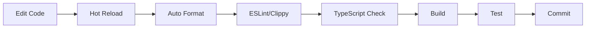

## Monorepo Structure

Modrinth uses a monorepo architecture to manage multiple applications and shared packages in a single repository. This approach enables:

- **Shared code** across web, desktop, and backend
- **Consistent versioning** and dependency management
- **Atomic changes** across multiple packages
- **Easier refactoring** and code reuse

## Monorepo Tooling

The repository uses:

- **[Turborepo](https://turbo.build/)** - Build orchestration and caching (configured in `turbo.jsonc`)
- **[pnpm workspaces](https://pnpm.io/workspaces)** - Package management and workspace linking (configured in `pnpm-workspace.yaml`)
- **Cargo workspaces** - Rust package management (configured in root `Cargo.toml`)

```yaml pnpm-workspace.yaml
packages:
  - 'apps/*'
  - 'packages/*'
```

## Directory Structure

```
modrinth/
├── apps/              # Applications
│   ├── frontend/      # Nuxt 3 website
│   ├── app/           # Tauri desktop shell
│   ├── app-frontend/  # Vue 3 app UI
│   ├── app-playground # App testing environment
│   ├── labrinth/      # Rust backend API
│   ├── daedalus_client # Daedalus CLI client
│   └── docs/          # Documentation (Astro)
├── packages/          # Shared libraries
│   ├── ui/            # Vue component library
│   ├── api-client/    # API client (Labrinth/Archon/Kyros)
│   ├── app-lib/       # Theseus (app backend library)
│   ├── assets/        # Styles, icons, design tokens
│   ├── utils/         # Shared utilities
│   ├── daedalus/      # Minecraft meta API library
│   ├── ariadne/       # Analytics library
│   └── ... (more packages)
├── .github/           # GitHub Actions workflows
├── scripts/           # Build and utility scripts
├── Cargo.toml         # Rust workspace config
├── package.json       # Root package.json
├── pnpm-workspace.yaml # pnpm workspace config
├── turbo.jsonc        # Turborepo config
└── docker-compose.yml # Local development services
```

## Applications (`apps/`)

### Frontend (Nuxt 3 Website)

**Path**: `apps/frontend/`  
**Tech**: Nuxt 3, Vue 3, Tailwind CSS

The main Modrinth website at [modrinth.com](https://modrinth.com).

- **Framework**: Nuxt 3 with SSR (Server-Side Rendering)
- **Routing**: File-based routing in `src/pages/`
- **State**: Pinia stores + TanStack Query for server state
- **API**: `@modrinth/api-client` via `NuxtModrinthClient`
- **Deployment**: Cloudflare Pages

**Key Features**:
- Project browsing and search
- User authentication and profiles
- Mod/modpack management
- Admin and moderation tools

### App Frontend (Vue 3)

**Path**: `apps/app-frontend/`  
**Tech**: Vue 3, Tailwind CSS

The frontend UI for the desktop application.

- **Framework**: Vue 3 (not Nuxt - no SSR)
- **Platform**: Runs inside Tauri WebView
- **API**: `@modrinth/api-client` via `TauriModrinthClient`
- **IPC**: Communicates with Theseus (Rust backend) via Tauri commands

### App (Tauri Desktop)

**Path**: `apps/app/`  
**Tech**: Tauri 2.x, Rust

The desktop application shell and native integrations.

- **WebView**: Hosts `app-frontend` UI
- **Backend**: Links `theseus` (app-lib) for core functionality
- **Platforms**: Windows, macOS, Linux
- **Features**: Auto-updates, deep links, system tray, window state

### Labrinth (Backend API)

**Path**: `apps/labrinth/`  
**Tech**: Rust, Actix-Web

The backend REST API serving all Modrinth clients.

- **Framework**: Actix-Web
- **Database**: PostgreSQL (primary), ClickHouse (analytics), Redis (cache)
- **Search**: Meilisearch
- **Storage**: S3-compatible (files, images)
- **Auth**: Session-based + API tokens
- **API Docs**: OpenAPI (utoipa) with Swagger UI

See [Backend (Labrinth)](/development/backend-labrinth) for details.

### Docs (Astro)

**Path**: `apps/docs/`  
**Tech**: Astro, Mintlify (this site)

The documentation site you're reading now.

### Other Apps

- **`app-playground`**: Testing environment for the desktop app
- **`daedalus_client`**: CLI tool for Daedalus protocol

## Packages (`packages/`)

### Frontend Packages (TypeScript)

#### `@modrinth/ui`

Shared Vue component library used by both website and desktop app.

- Vue 3 components (buttons, modals, cards, etc.)
- Cross-platform pages (used in both frontend and app-frontend)
- Composables and utilities
- Storybook for component development
- i18n translations (34 languages)

**Import**:
```typescript
import { Button, Modal, ProjectCard } from '@modrinth/ui'
```

#### `@modrinth/api-client`

Platform-agnostic API client for Modrinth services.

- Labrinth API (projects, versions, users)
- Archon API (Modrinth Hosting servers)
- Kyros API (server file management)
- Platform variants: `GenericModrinthClient`, `NuxtModrinthClient`, `TauriModrinthClient`
- Features: auth, retry, circuit breaker
- WebSocket support for real-time server events

**Import**:
```typescript
import { NuxtModrinthClient, AuthFeature } from '@modrinth/api-client'
```

See [Packages](/development/packages) for details.

#### `@modrinth/assets`

Styling, design tokens, and auto-generated icons.

- Tailwind CSS variables and theme configuration
- SVG icons (auto-generated from `icons/` directory)
- Color palettes and semantic tokens

#### `@modrinth/utils`

Shared utility functions for frontend code.

#### `@modrinth/blog`

Blog system and changelog data.

#### `@modrinth/moderation`

Moderation utilities and content filtering.

#### `@modrinth/tooling-config`

Shared ESLint, Prettier, and TypeScript configurations.

### Rust Packages

#### `theseus` (app-lib)

**Path**: `packages/app-lib/`

The Rust backend library for the desktop app.

- Profile and instance management
- Mod installation and updates
- Minecraft version management
- Java runtime detection
- Game launching
- Analytics and crash reporting
- Local database (SQLite)

**Exposed to frontend via**:
- Tauri commands (IPC)
- Event emitters for progress tracking

See [Desktop App](/development/desktop-app) for details.

#### `daedalus`

Rust library for Minecraft and mod loader metadata.

- Minecraft version manifests
- Forge, Fabric, Quilt version data
- Modpack parsing and validation

#### `ariadne`

Analytics library for tracking usage and events.

#### Other Rust Packages

- **`modrinth-log`**: Logging utilities
- **`modrinth-util`**: General utilities
- **`modrinth-maxmind`**: MaxMind GeoIP integration
- **`muralpay`**: Payment processing
- **`path-util`**: Cross-platform path utilities
- **`sqlx-tracing`**: SQLx query tracing
- **`labrinth-derive`**: Derive macros for Labrinth

## Technology Stack

### Frontend Stack

| Technology | Usage |
|------------|-------|
| **Vue 3** | UI framework |
| **Nuxt 3** | Website SSR framework |
| **Tailwind CSS v3** | Styling |
| **TanStack Query** | Server state management |
| **Pinia** | Client state management |
| **Tauri 2.x** | Desktop app shell |
| **Storybook** | Component development |
| **TypeScript** | Type safety |
| **pnpm** | Package manager |
| **Turborepo** | Build orchestration |
| **Vite** | Build tool |

### Backend Stack

| Technology | Usage |
|------------|-------|
| **Rust** | Backend language (Edition 2024) |
| **Actix-Web** | Web framework |
| **PostgreSQL 15** | Primary database |
| **ClickHouse** | Analytics database |
| **Redis** | Cache and rate limiting |
| **Meilisearch** | Search engine |
| **SQLx** | Database toolkit |
| **S3** | Object storage |
| **Sentry** | Error tracking |
| **Cargo** | Build system |

### Desktop App Stack

| Technology | Usage |
|------------|-------|
| **Tauri 2.x** | Desktop framework |
| **Rust (Theseus)** | Backend logic |
| **Vue 3** | Frontend UI |
| **SQLite** | Local database |
| **IPC** | Frontend ↔ Backend communication |

## Service Architecture

```
┌─────────────────────────────────────────────────────────────┐
│                         Clients                             │
├──────────────┬──────────────────┬──────────────────────────┤
│  Web Browser │   Desktop App    │      Mobile (future)     │
│   (Nuxt 3)   │  (Tauri + Vue)   │                          │
└──────┬───────┴────────┬─────────┴──────────────────────────┘
       │                │
       │                └─────────┐
       │                          │
       ▼                          ▼
┌──────────────┐          ┌──────────────┐
│   Labrinth   │          │   Theseus    │
│   (Rust API) │          │ (Local Rust) │
└──────┬───────┘          └──────┬───────┘
       │                          │
       ├──────────┬───────────────┤
       │          │               │
       ▼          ▼               ▼
┌──────────┐ ┌─────────┐   ┌──────────┐
│ PostgreSQL│ │ Meili-  │   │  SQLite  │
│ ClickHouse│ │ search  │   │  (Local) │
│   Redis   │ │         │   │          │
└───────────┘ └─────────┘   └──────────┘
       │
       ▼
┌──────────────┐
│  S3 Storage  │
└──────────────┘
```

### API Services

Modrinth has three main APIs:

1. **Labrinth** (`api.modrinth.com`) - Main REST API
   - Projects, versions, users, teams
   - Search, analytics, moderation
   - Authentication and authorization

2. **Archon** (`archon.modrinth.com`) - Modrinth Hosting API
   - Server management
   - Backups and restores
   - WebSocket real-time events

3. **Kyros** (node-specific) - File management API
   - Server file uploads/downloads
   - Directory browsing
   - File operations

## Build System

### Turborepo Configuration

The `turbo.jsonc` file defines build pipelines:

```jsonc
{
  "pipeline": {
    "build": {
      "dependsOn": ["^build"],
      "outputs": ["dist/**", ".nuxt/**", "build/**"]
    },
    "lint": {},
    "test": {
      "dependsOn": ["^build"]
    }
  }
}
```

Turborepo automatically:
- Builds dependencies in the correct order
- Caches build outputs
- Runs tasks in parallel when possible

### Workspace Dependencies

Packages reference each other using workspace protocol:

```json package.json
{
  "dependencies": {
    "@modrinth/ui": "workspace:*",
    "@modrinth/api-client": "workspace:*",
    "@modrinth/assets": "workspace:*"
  }
}
```

## Development Workflow



### Hot Reloading

- **Frontend**: Vite HMR (Hot Module Replacement)
- **Backend**: Manual restart (or use `cargo-watch`)
- **Desktop App**: Frontend HMR + manual Rust rebuild

## Deployment

See [Deployment](/development/deployment) for detailed information.

### Frontend Deployment

- **Platform**: Cloudflare Pages
- **Trigger**: Push to `main` branch
- **Build**: `pnpm pages:build` (Nuxt with Cloudflare preset)
- **Preview**: Automatic PR previews

### Backend Deployment

- **Platform**: Docker containers
- **Registry**: GitHub Container Registry (ghcr.io)
- **Orchestration**: Kubernetes
- **CI**: GitHub Actions builds Docker images

### Desktop App Deployment

- **Platform**: GitHub Releases
- **Build**: Cross-platform CI (Windows, macOS, Linux)
- **Updates**: Tauri auto-updater
- **Distribution**: Direct download from modrinth.com/app

## Code Organization Principles

### Separation of Concerns

- **Frontend apps** (`apps/frontend`, `apps/app-frontend`) contain app-specific logic
- **Shared components** (`packages/ui`) contain reusable UI elements
- **API client** (`packages/api-client`) handles all backend communication
- **Backend** (`apps/labrinth`) handles business logic and data

### Cross-Platform Pages

Pages shared between web and app live in `packages/ui/src/pages/` using the cross-platform pattern. See the `cross-platform-pages` skill for details.

### Dependency Injection

Services (API client, notifications, etc.) are provided via Vue's provide/inject using the `createContext` pattern. See the `dependency-injection` skill.

## Next Steps

<CardGroup cols={2}>
  <Card title="Backend (Labrinth)" icon="server" href="/development/backend-labrinth">
    Deep dive into the Rust API backend
  </Card>
  
  <Card title="Frontend (Web)" icon="window" href="/development/frontend-web">
    Learn about the Nuxt 3 website architecture
  </Card>
  
  <Card title="Desktop App" icon="desktop" href="/development/desktop-app">
    Understand the Tauri desktop application
  </Card>
  
  <Card title="Packages" icon="box" href="/development/packages">
    Explore shared packages and libraries
  </Card>
</CardGroup>
